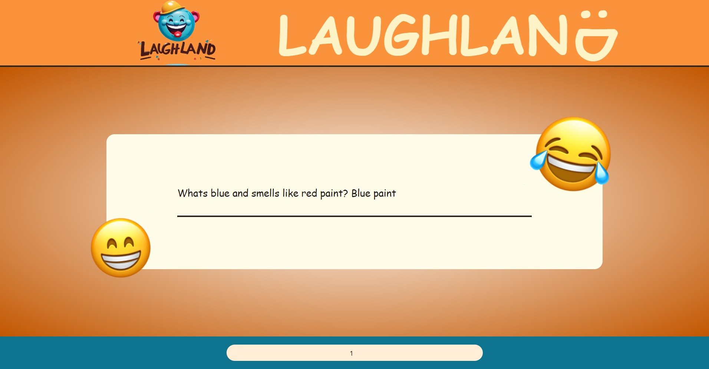

# LAUGHLAND

## Description

LAUGHLAND is a React application designed to fetch jokes from an external API and deliver a touch of humor and amusement. Users can adjust the number of jokes they want to see, sit back, and enjoy some good laughs. This README provides an overview of the project, how to use it, the technologies employed, and how to contribute to its development.

## Table of Contents

- [LAUGHLAND](#laughland)
  - [Description](#description)
  - [Table of Contents](#table-of-contents)
  - [Screenshots](#screenshots)
  - [Usage](#usage)
  - [API Information](#api-information)
  - [Technologies Used](#technologies-used)
  - [Contributing](#contributing)
  - [Contact Me](#contact-me)

## Screenshots

## Usage

To utilize the LAUGHLAND application, follow these straightforward steps:

1. Visit the live app at [https://laughland.netlify.app/](https://laughland.netlify.app/).
2. The app will display a default number of jokes (1 joke) upon loading.
3. To modify the number of jokes displayed, simply input a number between 1 and 30 in the provided input field located in the footer.
4. Enjoy the jokes and have a good laugh!

## API Information

The application fetches jokes from an external API. Here are the API details:

- **API Base URL**: `https://api.api-ninjas.com/v1/jokes`
- **API Key**: KEY from api-ninjas.com
- The app uses this API to retrieve jokes using the provided key.

## Technologies Used

LAUGHLAND is built using the following technologies:

- React: A popular JavaScript library for building user interfaces.
- React Hooks (useState, useEffect): Used for state management and side effects.
- Tailwind CSS: For styling and layout design.
- External API: To fetch and display jokes.

## Contributing

We welcome contributions to enhance the LAUGHLAND application. If you'd like to contribute, follow these steps:

1. Fork the repository on GitHub.
2. Clone the fork to your local machine.
3. Create a new branch for your feature or bug fix.
4. Make your changes and commit them.
5. Push your changes to your fork on GitHub.
6. Open a pull request to the main repository.

Please ensure you follow our code of conduct and respect our contribution guidelines.

Feel free to contribute to this project. If you find any issues or have suggestions for improvements, please open an issue or create a pull request.

## Contact Me

If you have any questions or suggestions, feel free to contact me:

- GitHub: [Adham Nasser](https://github.com/Adhamxiii)
- Linkedin: [Adham Nasser](https://www.linkedin.com/in/adhamnasser/)
